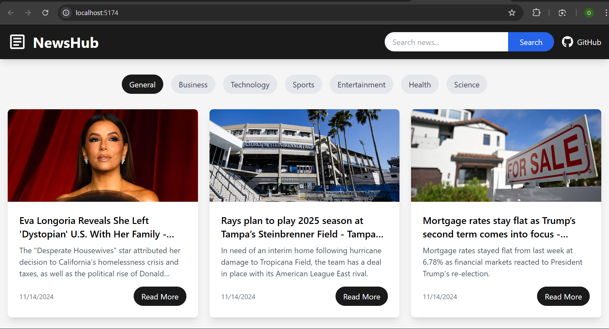
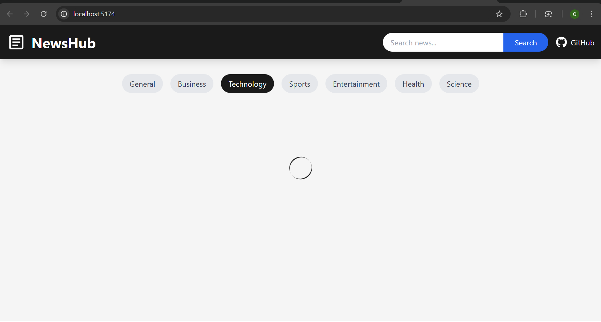
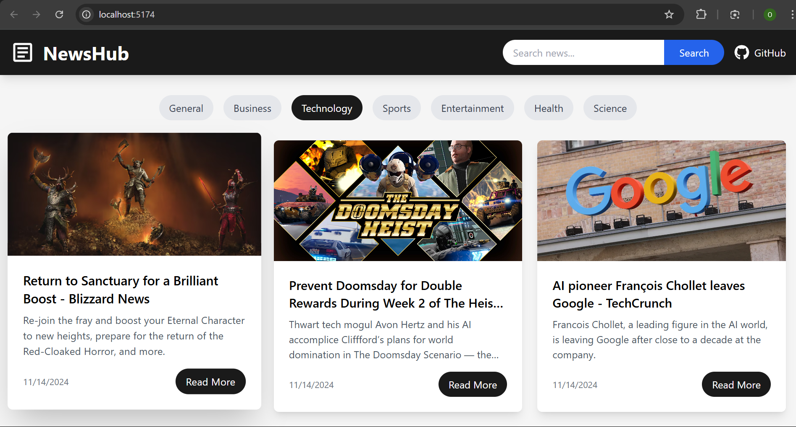
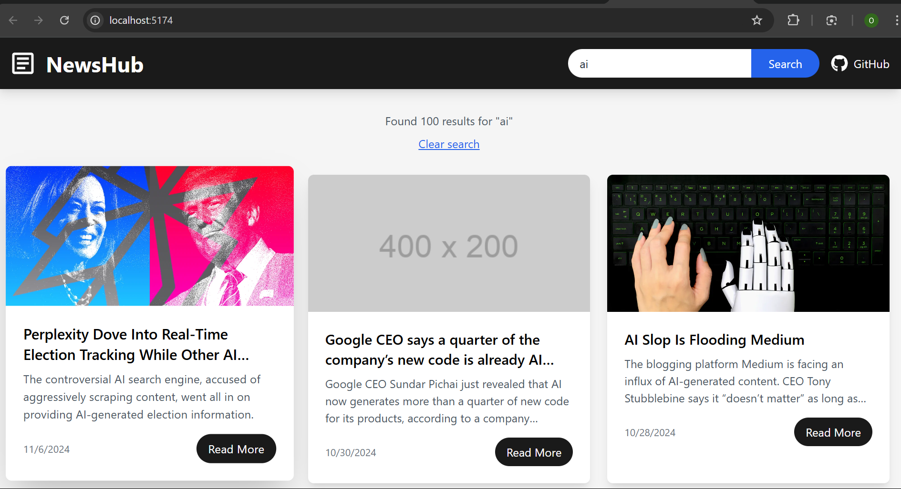

# NewsHub - Real-Time News Application

NewsHub is a modern, responsive news application built with React that provides real-time access to news articles from various categories using the NewsAPI.



## Features

- **Real-time News Updates**: Get the latest news articles from multiple reliable sources
- **Category Filtering**: Browse news by categories including:
  - General
  - Business 
  - Technology
  - Sports
  - Entertainment
  - Health
  - Science

- **Search Functionality**: Search for specific news articles across all sources
- **Responsive Design**: Fully responsive layout that works seamlessly on desktop and mobile devices
- **Modern UI**: Clean and intuitive user interface with smooth animations and transitions





## Search Results
Users can search for specific news topics and get relevant results instantly.



## Technical Stack

- **React**: Frontend library for building user interfaces
- **Tailwind CSS**: Utility-first CSS framework for styling
- **Axios**: Promise-based HTTP client for API requests
- **NewsAPI**: REST API for fetching real-time news data
- **Vite**: Next generation frontend tooling

## Getting Started

1. Clone the repository:

```bash
git clone https://github.com/onesmuskipchumba0/news-web-app.git
cd news-web-app
```

2. Install dependencies:

```bash
npm install
```

3. Create a `.env` file in the root directory and add your NewsAPI key:

```bash
VITE_NEWS_API_KEY=your_newsapi_key_here
```

4. Start the development server:

```bash
npm run dev
```

## Environment Variables

The following environment variables are required:

- `VITE_NEWS_API_KEY`: Your NewsAPI key (Get one at [NewsAPI](https://newsapi.org/))

## Building for Production

To create a production build:

```bash
npm run build
```

The build artifacts will be stored in the `dist/` directory.


## Contributing

Contributions are welcome! Please feel free to submit a Pull Request. For major changes, please open an issue first to discuss what you would like to change.

1. Fork the repository
2. Create your feature branch (`git checkout -b feature/AmazingFeature`)
3. Commit your changes (`git commit -m 'Add some AmazingFeature'`)
4. Push to the branch (`git push origin feature/AmazingFeature`)
5. Open a Pull Request

## License

This project is licensed under the MIT License - see the [LICENSE](LICENSE) file for details.

## Contact

Onesmus Kipchumba - [@onesmuskipchumba0](https://github.com/onesmuskipchumba0)

Project Link: [https://github.com/onesmuskipchumba0/news-web-app](https://github.com/onesmuskipchumba0/news-web-app)

## Acknowledgments

- [NewsAPI](https://newsapi.org/) for providing the news data
- [Tailwind CSS](https://tailwindcss.com/) for the styling framework
- [React Icons](https://react-icons.github.io/react-icons/) for the icons

## Screenshots

### Desktop View


### Mobile View


### Search Interface


---

Made with ❤️ by [Onesmus Kipchumba](https://github.com/onesmuskipchumba0)